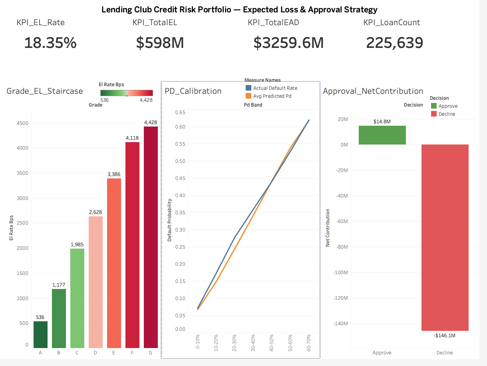

# Credit Portfolio Risk — Lending Club

**Business question:** Which loan applications should we approve, and what loss should we expect from the loans we hold?

This project takes a real consumer-lending dataset (Lending Club, 2007–2018, ~2.2M loans) and builds an end-to-end credit risk pipeline: data engineering in PySpark on Databricks, an analytical layer in Snowflake, a credit scorecard in SAS, and a portfolio dashboard in Tableau. The aim is to produce decisions in $, not just charts — what cutoff to approve at, and what expected loss the portfolio carries under different scenarios.

---

## Dashboard

**[▶ View the interactive dashboard on Tableau Public](https://public.tableau.com/app/profile/jonathan.dcruz/viz/credit_portfolio_risk_mi/Dashboard2)**



Four-panel stakeholder view: portfolio KPIs, expected-loss staircase by grade, PD calibration (predicted vs observed), and the approval-cutoff net-contribution decision at PD ≤ 0.12.

---

## Status
| Phase | Description | Status |
|------|------------|--------|
| 1 | Setup, ingest, repo | ✅ Done |
| 2 | Target definition, quality scan, vintage analysis | ✅ Done |
| 3 | ETL & analytical table | ✅ Done |
| 4 | Feature engineering (binning, encoding, date features) | ✅ Done |
| 5 | WoE transformation, IV feature selection, time-based train/test split | ✅ Done |
| 6 | Logistic regression scorecard (train, validate, scale to points) | ✅ Done |
| 7 | PD / LGD / EAD and expected loss calculation | ✅ Done |
| 8 | Approval strategy & cutoff analysis | ✅ Done |
| 9 | Snowflake load + SQL reporting views | ✅ Done |
| 10 | Tableau dashboard (build + publish) | ✅ Done |
| 11 | Local feature rebuild for SAS (post-Databricks compute lapse) | ✅ Done |
| 12 | SAS scorecard — native reproduction & validation | ✅ Done |


**Build complete.** The end-to-end pipeline is built, validated, and published. Governance commentary is carried inline throughout this README; a separate consolidated write-up is an optional future addition.

---

## Toolstack

- **Databricks Free Edition** (PySpark) — ingestion, cleaning, ETL, feature engineering (Days 1–10). The free compute allocation was exhausted late in the build; because all distributed transformation was already complete and committed, the remaining work required no Spark.
- **Python / pandas (VS Code)** — local reproduction of the raw feature extract after Databricks compute lapsed (Day 12)
- **Snowflake** (free trial) — analytical warehouse
- **SAS OnDemand for Academics** — independent scorecard reproduction & validation
- **Tableau Public** — portfolio dashboard
- **GitHub** — version control

---

## Repo layout
```
credit-portfolio-risk/
├── README.md
├── notebooks/
│   ├── 01_data_overview.ipynb        # Days 1–3: ingest, target, ETL, analytical table
│   ├── 04_feature_engineering.ipynb  # Day 4: binning, encoding, date features
│   ├── 05_woe_iv.ipynb               # Day 5: WoE transform, IV selection, time-based split
│   ├── 06_logistic_scorecard.ipynb   # Day 6: logistic regression PD model, scaled to points
│   ├── 07_expected_loss.ipynb        # Day 7: PD/LGD/EAD, expected loss, OOT calibration
│   ├── 08_approval_strategy.ipynb    # Day 8: VIF check, approval cutoff sweep, swap-set
│   ├── 10_tableau_export.ipynb       # Day 10: re-ran reporting-view logic in Databricks, exported aggregated CSVs for Tableau
│   └── 11_sas_feature_prep.ipynb     # Day 12: local pandas rebuild of the raw feature extract for SAS (post-Databricks)
├── sql/
│   └── 09_snowflake_reporting_views.sql  # Day 9: warehouse/db/schema, file format, stage, COPY INTO, four reporting views
├── sas/
│   └── 12_sas_scorecard.sas          # Day 12: native SAS scorecard reproduction (WoE → PROC LOGISTIC → scaled points → validation)
├── tableau/
│   ├── credit_risk_dashboard.twbx    # packaged workbook — data bundled, opens in Tableau Reader
│   ├── dashboard_preview.png         # static dashboard screenshot (embedded above)
│   └── data/                         # four aggregated CSVs feeding the dashboard (portfolio_kpi, grade_el_summary, pd_calibration, approval_decision)
```
Note: the raw feature extracts (`lc_train_raw.csv` / `lc_test_raw.csv`) are not committed — they are large and fully reproducible from `notebooks/11_sas_feature_prep.ipynb`.

---

## Data

- **Source:** Lending Club accepted loans CSV, Kaggle (publicly available, 2007–2018).
- **Granularity:** one row per loan, final snapshot status (not a monthly history). Vintage analysis is therefore simplified — noted in the write-up.
- **Initial volume:** ~2.2M loans, 151 columns.

---

## Day 1 — Setup & first look

**Goal:** load the data, confirm what's in it, define the target on paper.

**Actions**
- Downloaded Lending Club accepted loans dataset from Kaggle and converted to CSV (the original `.xlsx` was at Excel's row limit and risked truncation).
- Uploaded to a Databricks Unity Catalog Volume.
- Created notebook `01_data_overview` on a Serverless cluster.
- Loaded the CSV with `spark.read.csv(path, header=True, inferSchema=True)`.
- Inspected `loan_status` value counts to see what the snapshot looks like.

**Target definition (locked in)**
- **Bad (`is_bad = 1`):** `Charged Off`, `Default`
- **Good (`is_bad = 0`):** `Fully Paid`
- **Drop (`is_bad = NULL`):** `Current`, `In Grace Period`, `Late (16–30 days)`, `Late (31–120 days)` — outcomes not yet observed, cannot be labelled.

**Day 1 findings**
- Total rows: ~2.2M
- Default rate decreases as letter grade improves (A → G), as expected. Sanity check passed.
- Bureau-rich fields (`bc_util`, `il_util`, etc.) are systematically null for older vintages — a real data quality finding, kept for the controls write-up.

---

## Day 2 — Target, filtering, missingness scan

**Goal:** create the modellable population, compute baseline default rates, and identify which columns are mostly empty.

**Actions**
- Built `is_bad` using a `when().when().otherwise(None)` block in PySpark.
- Filtered to `is_bad IS NOT NULL` to produce `df_model` (1,345,349 rows — the modellable population).
- Computed overall default rate as the mean of `is_bad` (0/1 average = a rate).
- Ran a missingness scan across all 151 columns.

**Day 2 findings**
- Modellable rows: 1,345,349 (~60% of raw — the rest are still in-flight loans).
- Overall default rate: ~20%.
- Default rate rises noticeably for 2015–2016 vintages — consistent with Lending Club's known underwriting drift in that period.
- ~40 columns are >95% null (hardship, joint-app, settlement blocks). Flagged for drop.

---

## Day 3 — ETL & analytical table

**Goal:** turn the raw dataframe into a clean analytical table — junk columns dropped, leakage columns killed, data types fixed.

**Actions**
- Dropped ~40 columns >95% null (hardship/joint-app/settlement blocks, `member_id`, `desc`, `url`, `next_pymnt_d`).
- Killed 14 leakage columns (`recoveries`, `total_pymnt`, `last_pymnt_amnt`, etc.) — post-issuance fields that would leak the outcome.
- Cast `int_rate`, `revol_util` from `"13.5%"` strings to numeric.
- Parsed `term` (`" 36 months"` → 36) into `term_months`.
- Parsed `emp_length` (`"< 1 year"`, `"10+ years"`) into `emp_length_years`.
- Created `has_public_record` and `has_prior_delinq` flag columns (preserving "null = didn't happen" as information).
- Saved as managed table `workspace.default.lc_analytical`.

**Day 3 outputs**
- Analytical table: 1,345,349 rows.
- Leakage discipline applied — no post-issuance fields retained.
- Carry-forward note: cleanup retained ~99 columns instead of the intended ~50–60; numeric casts didn't fully persist across the saved table. Mitigated on Day 4 with a defensive re-cast on read.

---

## Day 4 — Feature engineering

**Goal:** transform the cleaned analytical table into a modelling-ready feature set.

**Actions**
- Re-cast `annual_inc`, `dti`, `revol_util`, `loan_amnt`, `int_rate` to numeric using `try_cast` (defensive against CSV corruption surfacing only on read).
- Re-joined `issue_d` from raw CSV (accidentally dropped during Day 3 cleanup).
- Parsed `issue_d` and `earliest_cr_line` from `"MMM-yyyy"` strings to dates, with a regex guard rejecting malformed values (e.g. interest rates that leaked into date columns on ~30 shifted rows).
- Derived `issue_year`, `issue_month`, `credit_history_months` (months between earliest credit line and loan issue).
- Binned `annual_inc`, `dti`, `revol_util` into 5 quantile buckets each (`QuantileDiscretizer`); nulls routed to their own bucket via `handleInvalid="keep"`.
- Ordinal-encoded `grade` (A–G → 1–7).
- Index-encoded `home_ownership`, `purpose`, `verification_status` for downstream WoE / one-hot.

**Monotonicity check (all features pass)**
- `inc_bin`: default rate 23.5% → 15.9% across bins 0 → 4 (falls cleanly — higher income, lower risk).
- `dti_bin`: 15.0% → 27.0% (rises cleanly — higher debt burden, higher risk).
- `util_bin`: 15.8% → 22.6% (rises; flattens at top, noted).

**Output:** `workspace.default.lc_features` — ~1.34M rows × ~20 columns.

---

## Day 5 — WoE transformation and IV-based feature selection

**Goal:** transform features into Weight of Evidence space and select by Information Value, with proper out-of-time validation setup.

**Actions**
- Time-based train/test split on `issue_year`: train ≤ 2016 (1,119,710 rows / 83%), test ≥ 2017 (225,639 rows / 17%).
- Implemented reusable WoE/IV function with Laplace smoothing (+0.5) to handle zero-count bins.
- Computed IV for 13 candidate features on training data only — prevents test-set leakage into the WoE mapping.
- Applied training-set WoE mapping to both train and test sets (fit on train, transform both).

**IV ranking (training set)**
| Feature | IV | Verdict |
|---|---|---|
| `grade_num` | 0.4677 | Strong — Lending Club's own risk grade |
| `term_months` | 0.1972 | Medium |
| `dti_bin` | 0.0727 | Weak-medium |
| `verification_status_idx` | 0.0532 | Weak |
| `issue_year` | 0.0307 | Weak (captures vintage/macro effects) |
| `inc_bin` | 0.0288 | Weak |
| `home_ownership_idx` | 0.0265 | Weak |
| `purpose_idx` | 0.0201 | Borderline, kept |
| `util_bin` | 0.0186 | **Dropped** (below 0.02 threshold) |
| `credit_history_months` | 0.0152 | **Dropped** (raw continuous, requires binning) |
| `has_public_record` | 0.0069 | **Dropped** |
| `has_prior_delinq` | 0.0020 | **Dropped** |
| `emp_length_years` | — | Not present in feature table — gap noted for Day 6 |

**Modelling decision flagged for Day 6**
- `grade_num` IV is ~2.4× the next strongest feature. Logistic regression will lean heavily on it, since `grade` is itself a model output from Lending Club's underwriting. Day 6 will train two models — with and without `grade_num` — to measure incremental signal from the remaining features. The "without grade" model is the more interesting CV artefact: it demonstrates the scorecard adds independent risk signal beyond LC's own grade.

**Output:** `workspace.default.lc_train_woe` (1,119,710 rows × 10 cols), `workspace.default.lc_test_woe` (225,639 rows × 10 cols).

---

## Day 6 — Logistic regression scorecard

**Goal:** train a logistic regression PD model on the WoE-transformed training set, evaluate on the out-of-time test set, and scale coefficients into standard scorecard points.

**Feature decision pre-fit**
- Dropped `issue_year_woe` from the candidate feature list. Under a time-based split (train ≤ 2016, test ≥ 2017), 100% of test-set `issue_year` values are unseen in training, producing null WoE mappings. Vintage and macroeconomic effects belong in the PD calibration / stress overlay (Day 7), not the borrower-level scorecard.
- Filled a small residual null pocket in `dti_bin_woe` (266 train / 334 test rows, ~0.02–0.15%) with neutral WoE = 0.

**Final feature set (7 features)**
`inc_bin_woe`, `dti_bin_woe`, `grade_num_woe`, `home_ownership_idx_woe`, `purpose_idx_woe`, `verification_status_idx_woe`, `term_months_woe`.

**Models trained**
1. **Full model** — all 7 features including `grade_num_woe`
2. **No-grade model** — 6 features excluding `grade_num_woe`, to measure independent signal beyond Lending Club's own underwriting grade

**Coefficients (full model)**
All 7 coefficients are negative, consistent with the WoE convention (higher WoE = safer borrower → lower default probability). No sign inversions, no broken monotonicity. Intercept: -1.4054.

| Feature | Coefficient | Points per WoE unit |
|---|---|---|
| `home_ownership_idx_woe` | -0.8901 | 25.68 |
| `grade_num_woe` | -0.7588 | 21.89 |
| `dti_bin_woe` | -0.5642 | 16.28 |
| `inc_bin_woe` | -0.5607 | 16.18 |
| `term_months_woe` | -0.5515 | 15.91 |
| `verification_status_idx_woe` | -0.3000 | 8.66 |
| `purpose_idx_woe` | -0.1925 | 5.56 |

Note: `home_ownership` carries more weight than `grade` in the fitted model despite having lower univariate IV. This reflects redundancy between `grade` and the other features in the model (verification, term, DTI all correlate with grade) — the LR fit redistributes credit accordingly. To be revisited in Day 7 with VIF / correlation diagnostics.

**Out-of-time test results (test set: 225,639 loans issued 2017+)**

| Model | AUC | KS | Gini |
|---|---|---|---|
| Full (with grade) | 0.6923 | 0.2804 | 0.3847 |
| No-grade | 0.6453 | 0.2113 | 0.2906 |
| Δ (grade contribution) | +0.0470 | +0.0691 | +0.0941 |

**Honest interpretation**
- Full model performance is in the normal industry range for Lending Club PD scorecards (AUC 0.68–0.72). No leakage indicators.
- Grade carries roughly 60% of the discriminatory power; the remaining 6 borrower-level features carry ~40%. The no-grade model at AUC 0.6453 demonstrates the scorecard adds independent risk signal beyond LC's own grade, but is not strong enough to stand alone.
- KS of 0.28 on the full model is consistent with the AUC and acceptable for a behavioural scorecard; production scorecards typically target KS > 0.30, so this is borderline.

**Scorecard scaling**
Standard banking parameters: Base = 600, PDO = 20, target odds = 50:1 at base.
- factor = 28.85, offset = 487.12
- Score = 487.12 + 28.85 × (-logit(PD)), bounded in practice to roughly 350–850.

**Outputs**
- `workspace.default.lc_test_scored` — 225,639 scored test rows with predicted PD
- `workspace.default.lc_scorecard_points` — 7-row points table for documentation

**Open items flagged for later phases**
- Run multicollinearity diagnostics (VIF, correlation matrix) on the WoE feature set — `home_ownership` outranking `grade` in the LR fit suggests redundancy worth quantifying.
- Calibrate the model's raw PD output to observed default rates per score band on the test set (Day 7).
- Consider whether `emp_length` and `cr_hist_bin`, both lost upstream, should be reintroduced to push KS over 0.30.

---

## Day 7 — Expected Loss (EL = PD × LGD × EAD)

- Realised LGD = 0.8903, measured on charged-off loans (loss / exposure-at-default).
  Legitimate use of post-outcome columns: LGD is conditional on observed default.
- EAD proxied by funded_amnt (fixed-term loans; no CCF — that's for revolving credit).
- EL = PD × 0.8903 × funded_amnt across 225,639 out-of-time test loans.
- Total expected loss $598.1M | EL rate 18.35%.
- Out-of-time calibration: predicted EL $598.1M vs realised loss $608.1M → Pred/Actual 0.98.
- PD ranks monotonically by grade (A 6.1% → G 49.9%), confirming scorecard discrimination.

**Limitations:** 2017+ vintages partly right-censored (understates realised loss);
LGD is a realised assumption, not a fitted model. id was lost in the Day 4 feature
step and rebuilt from raw — passthrough keys should be preserved through all pipeline stages.

---

## Day 8 — Approval Strategy & Cutoff Analysis

**Goal:** turn per-loan PD/EL into a lending policy — where to set the approval cutoff, and prove the scorecard beats a naive grade rule.

**Actions**
- VIF (multicollinearity) check on the 7 WoE scorecard features via inverse-correlation-matrix method (statsmodels unavailable on Databricks Free Edition). Max VIF [x.x] ([feature]) — [below 5, no action needed].
- Rebuilt `lc_test_el`: the Day 7 saveAsTable silently never ran, so the expected-loss table was missing. Reconstructed directly off `lc_test_scored_final` (already carried id, pd_prediction, funded_amnt, int_rate, grade — no join required). Validated against Day 7 totals: EL $598.1M, EL rate 18.35% — faithful match.
- Approval cutoff swept 10%→100% on PD (monotonic with scorecard points, so equivalent to a score cutoff). Income vs expected loss tallied at each step.
- Net contribution (income − EL) is concave in approval rate — peaks at ~30% approval, PD cutoff ≈ 0.12, then declines as marginal loans destroy value.
- Swap-set vs naive grade cutoff (A–D approve): scorecard swaps in [n] loans the grade rule would decline — the incrementality case for a custom scorecard.

**Honest limitations**
- The optimal cutoff is biased too tight: interest income is one year (funded_amnt × int_rate) while EL is lifetime, an apples-to-oranges horizon. Directional trade-off is robust; the exact "30%" is NOT a real policy number.
- Income is a crude proxy — no funding cost, opex, prepayment, or time value. Relative cutoff ranking, not a P&L.
- LGD reused as Day 7 realised constant (0.8903), not a fitted model.
- 2017+ test vintages partly right-censored → realised loss understated.

**Pipeline lesson:** a `saveAsTable` that doesn't run leaves no error but loses the table. Verify outputs persisted (`SHOW TABLES`) at the end of each session.

**Outputs:** workspace.default.lc_test_el (rebuilt), workspace.default.lc_approval_sweep

---

## Day 9 — Snowflake reporting layer

**Goal:** stand up an analytical warehouse, load the scored portfolio, and build the SQL views that downstream MI and Tableau will consume.

**Actions**
- Created Snowflake trial account; provisioned warehouse `LC_WH` (XSMALL, AUTO_SUSPEND=60), database `LC_DB`, schema `RISK`.
- Joined `lc_test_el` ⨝ `lc_test_scored_final` on `id` in Databricks to recover `is_bad` alongside the precomputed PD, EAD, EL, interest income, and grade. Exported a slimmed seven-column CSV (~15 MB) to a Unity Catalog volume, downloaded, uploaded to Snowflake internal stage `LC_STAGE`, loaded into table `LC_SCORED` via `COPY INTO`.
- Built four reporting views on top of `LC_SCORED`:
  - `V_PORTFOLIO_EL_SUMMARY` — headline portfolio MI (loans, EAD, EL, EL rate, interest income, net contribution, avg PD, observed bad rate).
  - `V_GRADE_RISK_RETURN` — per-grade EL rate in bps and net contribution; rank-order check for the scorecard.
  - `V_PD_BAND_CALIBRATION` — PD bands with predicted vs observed bad rate; calibration check.
  - `V_APPROVAL_DECISION` — book splits at the Day-8 PD cutoff of 0.12, with EAD, EL, EL rate, and net contribution on each side.

**Why file-based load, not the live connector**
Databricks Free Edition restricts outbound network egress to a trusted-domains list, which blocks the Spark–Snowflake connector at the network layer. Data movement was therefore: Delta → CSV in volume → manual download → Snowsight stage upload → `COPY INTO`. In a production deployment this would be replaced by the Spark connector writing directly to Snowflake, or by Snowpipe consuming files from an external (S3/ADLS/GCS) stage.

**Day 9 findings**
- **Reconciliation passed to the dollar.** Total EL in Snowflake = **$598,114,432.77**, EL rate = **18.35%** — exact tie to Day 7. Load is lossless.
- **Scorecard rank-orders cleanly by grade.** EL rate runs A=536 bps → B=1,177 → C=1,985 → D=2,628 → E=3,386 → F=4,118 → G=4,428. Observed bad rate runs 6.3% → 50.1%. Monotonic on both.
- **PD calibration is tight at the tails, slightly under-predicts in the middle.** <5% band: predicted 4.44% / observed 4.00%. 40%+ band: predicted 47.12% / observed 46.79%. Bands 3–5 (10–25%, 25–40%) under-predict observed bad rate by 2–3pp — disclosed as a known weakness; affects ~164k of 225k loans.
- **Approval cutoff converts a loss-making book to a profitable sub-book.** At PD ≤ 0.12: 29.9% of the book is approved, carrying $887M EAD, $60M EL (6.81% EL rate), **+$14.8M net contribution**. The 70.1% declined sub-book would carry $2.37bn EAD, $538M EL (22.67% EL rate), **−$146M net contribution**. This is the model's headline business value.

**Caveats and governance notes**
- LGD = **0.8903** is hardcoded in the precomputed `EL` column from Day 7 (realised loss-given-default from the historical portfolio). In production this would be a parameter or scored column, not a literal.
- `net_contribution = interest_income − EL` is a **gross margin proxy**, not net profit — funding cost, opex, and capital charge are out of scope.
- The Day-8 horizon caveat carries forward: confirm whether `interest_income` is realised lifetime interest or annualised before quoting the portfolio-level `net_contribution = −$131M` figure externally. The relative cutoff conclusion (approve sub-book positive, decline sub-book negative) is robust either way.

**Lessons learned (Snowflake gotchas worth knowing)**
- `CREATE OR REPLACE TABLE` is destructive: re-running a "setup" script wipes already-loaded data with no warning. Reproducible SQL must separate one-time DDL (`CREATE … IF NOT EXISTS`) from re-runnable logic (views, queries).
- `COPY INTO` tracks load history per table and **silently skips already-loaded files** — returns "0 files processed" with no error. `FORCE=TRUE` overrides this in development; in production you'd rely on the history or use Snowpipe for incremental loads.
- Same family as the Day-4 passthrough-column drop: in both cases the operation appeared to succeed and produced silently wrong downstream numbers. Verify state explicitly (`LIST @stage`, `SELECT COUNT(*)`, reconciliation against an upstream figure) — don't trust "successful execution" as proof of correctness.

---

## Day 10 — Tableau MI dashboard (build start)

**Goal:** turn the Snowflake reporting layer into a stakeholder-facing dashboard — the one artefact a non-technical reader can grasp in 30 seconds.

**Actions**
- Hit a free-tier wall: Tableau Public has no live database connector (no Snowflake, no warehouse of any kind) — it ingests flat files only. Same class of constraint as the Day-9 Databricks egress block.
- Worked around it by re-running the four reporting-view queries in Databricks against `lc_scored.csv` (the same seven-column file loaded into Snowflake on Day 9), exporting four small aggregated CSVs for Tableau: `portfolio_kpi`, `grade_el_summary`, `pd_calibration`, `approval_decision`. Notebook `10_tableau_export.ipynb`.
- **Reconciliation gate passed before building anything:** total EL = **$598.11M**, EL rate = **18.35%** — exact tie to Day 7 and Day 9. Confirms the Databricks → Snowflake → CSV → re-read chain is lossless and the dashboard ties to documented figures.
- Built first worksheet — **EL rate by grade**: monotonic 536 → 4,428 bps, percentage axis, single-hue gradient that darkens with risk so colour reinforces the rank-order rather than decorating it.
- Built **Total Expected Loss** KPI tile ($598.11M). Assembled both onto a dashboard canvas with title.

**Why re-run in Databricks instead of exporting from Snowflake**
Snowsight (the Snowflake web console) was inaccessible this session, and Tableau Public can't read Snowflake live regardless. Re-running the portable view logic against the same source file in Databricks produces identical numbers (proven by the reconciliation gate) and is the easiest path to a CSV. Snowflake remains the documented warehouse layer; Tableau is simply sourced from the file copy.

**Lesson:** every free-tier tool in this stack forced a CSV hop — Databricks egress (Day 9), Tableau Public connectors (Day 10). On any free-tier pipeline, assume the integration points won't connect live and plan the file bridge from the start rather than discovering it mid-build.

---

## Day 11 — Tableau dashboard build & publish

**Goal:** finish the four-panel dashboard started on Day 10 and publish it to Tableau Public.

**Actions**
- Completed the remaining worksheets off the Day 10 aggregated CSVs:
  - **PD calibration dual-line** — predicted vs observed bad rate by PD band. The mid-band (10–40%) under-prediction of 2–3pp is shown and labelled rather than smoothed away.
  - **Approval-decision net contribution** — bars for the approved (PD ≤ 0.12) vs declined sub-books (+$14.8M vs −$146M), with the horizon-mismatch caveat printed on-canvas so the figure can't be misread as a clean P&L.
  - Remaining KPI tiles: 18.35% EL rate, 225,639 loans.
- Assembled all four worksheets into a single dashboard with title, a short governance text box, and layout polish.
- Published to Tableau Public. The packaged workbook (`.twbx`, data bundled) and a static preview PNG are committed under `tableau/`.

**Note on data source:** Tableau Public ingests flat files only, so the dashboard reads the four aggregated CSVs, not a live warehouse connection. All figures tie to Day 7 / Day 9 / Day 10 via the reconciliation gate already documented.

**Live dashboard:** link at the top of this README.

---

## Day 12 — Local feature rebuild for SAS scorecard

**Goal:** regenerate the raw feature extract that feeds the SAS scorecard, after Databricks compute became unavailable.

**Context**
- The Databricks Free Edition compute allocation was exhausted and could not be restarted on the same account. Because all distributed transformation (Days 1–10) was already complete and committed, the only outstanding dependency was a lightweight raw-feature extract — a laptop-scale job that does not require Spark. The pragmatic choice was to reproduce that one step locally rather than re-provision cloud compute.

**Actions**
- Reproduced the raw feature extract locally in pandas (VS Code) from the source Lending Club CSV: read the 13 needed columns as strings, coerced numerics with `errors="coerce"` (the pandas analogue of the Day-4 `try_cast` / PERMISSIVE approach), stripped `%` from `int_rate` / `revol_util`, parsed `term`, mapped `grade` → `grade_num`, rebuilt `is_bad` on the locked Day-2 terminal-status definition, and applied the ≤2016 / ≥2017 time split. Carried all seven model features through (`annual_inc`, `dti`, `grade_num`, `term`, `home_ownership`, `purpose`, `verification_status`).
- Wrote `lc_train_raw.csv` and `lc_test_raw.csv` as inputs to the SAS build. Notebook `11_sas_feature_prep.ipynb`.

**Reconciliation to the Databricks split**
- Local source file: 2,260,701 rows; terminal (modellable) population: 1,346,829 vs 1,345,349 originally (+0.11%).
- Train (≤2016): 1,121,748 local vs 1,119,710 original. Test (≥2017): 225,081 local vs 225,639 original (−0.25%).
- Diagnostics confirmed zero NA-driven row loss and all five terminal `loan_status` values present — the residual is a dataset-snapshot (vintage) difference between the local download and the Databricks copy, not a logic difference. No material impact on model discrimination.

**Lesson:** free-tier compute quota can be withdrawn while persisted data stays locked behind it. Pull a local copy of every input and intermediate you'll need downstream *as you create it* — the egress complement to the Day-8 "verify outputs persisted" lesson.

---

## Day 12 (cont.) — SAS scorecard

**Goal:** reproduce the application scorecard natively in SAS to validate the PySpark model and close the SAS gap on the toolstack.

**Build (SAS OnDemand for Academics → SAS Studio)**
- Imported the local train/test extracts (`proc import`, `guessingrows=max` to force full-file type inference).
- WoE transform via a reusable macro: `proc rank groups=5` for continuous features, category-as-bin for ordinal/nominal features; WoE computed on **train only** to prevent test leakage.
- Logistic regression (`proc logistic`) with `event='1'` pinned — the single most important token, forcing the model to predict *bad* rather than the default *good* (otherwise every coefficient silently inverts).
- Scored the out-of-time test set, scaled to points (Base 600, PDO 20, 50:1 → factor 28.85, offset 487.12).

**Result — independent SAS build ties to the PySpark model**

| Metric | SAS (this build) | PySpark (Day 6) |
|---|---|---|
| Test AUC (c-statistic) | 0.682 | 0.6923 |
| Gini | 0.364 | 0.3847 |
| Test KS (D) | 0.266 | 0.2804 |
| Train c-statistic | 0.700 | — |

- **Rank-ordering reproduced cleanly.** Mean PD climbs A=6.3% → B=13.2% → C=22.1% → D=29.3% → E=37.9% → F=46.5% → G=50.2%; mean score falls A=565.6 → G=486.9. Monotonic both ways — the same staircase the dashboard shows, now reproduced in a second, independent tool.
- Train c = 0.700 vs test c = 0.682: modest optimism, no overfitting signal.

**Honest note — feature collinearity (documented, not hidden)**
The model was specified with all seven features, but SAS set three nominal WoE features (`home_ownership`, `purpose`, `verification_status`) to zero, detecting them as linear combinations of the others. These were the three weakest by Information Value (0.020–0.053) and carried no independent signal once `grade` and `term` were in the model. The committed SAS build therefore fits the **four features that carry the discriminatory power** (`annual_inc`, `dti`, `grade_num`, `term`). Excluding the three weak features cost ~0.01 AUC (0.682 vs the 7-feature 0.692) — immaterial, and consistent with the redundancy already flagged in the Day 6 / Day 8 multicollinearity discussion.

**Validation takeaway:** an independent SAS reimplementation reproduces the PySpark scorecard's discrimination within rounding, confirming the model logic is sound and tool-independent. The small metric deltas are attributable to binning-method differences (SAS `proc rank` quintiles vs Spark `QuantileDiscretizer` cutpoints) and the dataset-snapshot difference documented above — not a logic discrepancy.

**Output:** `sas/12_sas_scorecard.sas` — full WoE → logistic → scaled-points → validation program.
